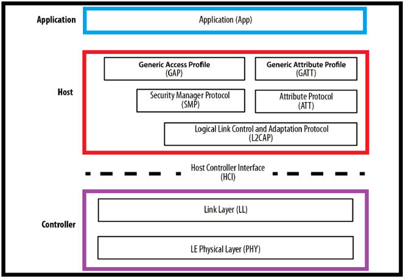
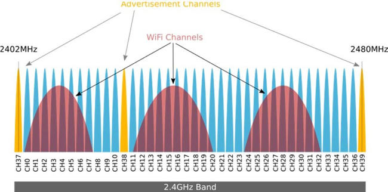
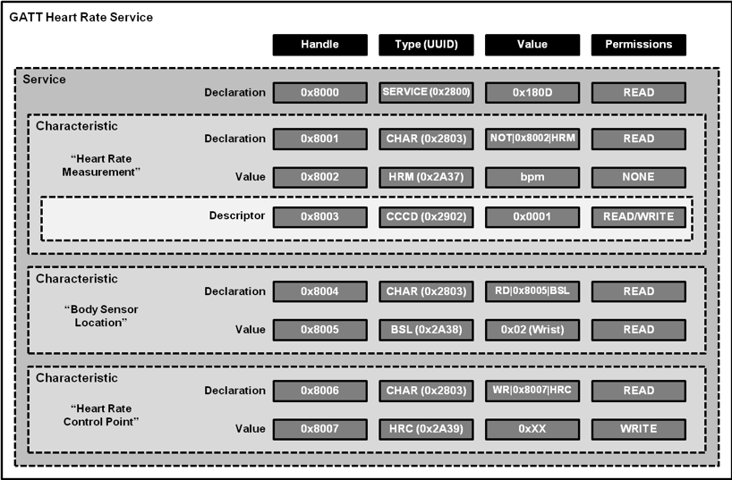

## BLE Basics
Bluetooth Low Energy or BLE (IEEE 802.15.1) is an emerging technology that was introduced in 2010 as a cheaper alternative to ZigBee (IEEE 802.15.4) for IoT devices. ZigBee is a protocol similar to BLE and can be seen in smart home automation and industrial systems such as water meters. BLE technology is utilized in devices ranging from the Tile tracker to diabetic insulin pumps. In this article, we will take a look at the basic of BLE, how devices communicate, and the basic of BLE security. 
One of the confusing parts of BLE is the concept of Bluetooth cross-compatibility. Below is a quick breakdown of common types of Bluetooth technology:
* **Bluetooth** – Traditional devices such as headphones, keyboards. These devices can send rich and large about of data. This a major difference in BLE. 
* **Bluetooth Smart Ready** – Devices that are backward compatible with legacy Bluetooth but can connect and interact with Smart or BLE devices.
* **Bluetooth Smart** – BLE devices such as blood pressure monitors, car keys, and various IoT devices. These devices connect and send very small amounts of data. 

The BLE protocol is broken into in three buckets: Application, Host, & Controller. In the next section, we will look at the BLE controller layer and how the physical & link layer work together to establish BLE connections

## BLE Physical Layer & Link Layer Connections

BLE devices are optimized for low power and with IoT devices in mind. They perform simple state, one-off transaction to share data between devices. Before these devices can communicate, they first have to connect. To do that these devices operate on the 2.4 GHz Industrial Scientific and Medical (ISM) band. The ISM band is a group of radio bands or parts of the radio spectrum that are internationally reserved for the use of radio frequency (RF) for scientific, medical and industrial requirements rather than for communications. While the 2.4 GHz spectrum is home to BLE, it is also home to some other wireless technologies such as ZigBee & Wi-Fi. To operate seamlessly with other devices wireless protocols utilize certain channels within the spectrum to eliminate congestion. As a connection process starts, BLE devices will advertise on channels 37, 38, & 39. These channels are for advertising, device discovery, connection establishment, and broadcast transmissions. The BLE link layer roles and states are an advertiser, scanner, slave, and master. 

During a connection, the scanner or the device wishing to connect discovers devices advertising for a connection. The scanner responds with a connection request packet. Once connected, the advertiser who accepted the initiation request is referred to as the slave while the device that originally scanned for a connection is the master. This connection request packet is a critical piece of information containing the following about the BLE connection:
* **Frequency Hopping Sequence** – The BLE protocol utilized a method of radio signal transmission known as frequency hopping spread spectrum. Frequency-hopping spread spectrum (FHSS) is a method of transmitting radio signals by rapidly switching a carrier among many frequency channels, using a pseudorandom sequence known to both transmitter and receiver.
* **Connection Interval** – How much time will there be between connection events?
* **Slave Latency** – How often will I listen for incoming connections?
* **Supervision Timeout** – This is the maximum time between two received packets before a connection is considered lost or closed.

Once a BLE connection is made, we depend on the Security Manager (SMP) and Generic Access Profile (GAP) layers to provide secure communications. The encryption key generation by the Security Management Protocol is known as a Short Term Key (STK). Many people are familiar with this process in  BLE as it is often referred to as device pairing or bonding. The STK can be exchanged using the various methods. For example:

* **Just Works**
  * Using this pairing method, the STK is exchanged by the master and slave in clear text. BLE devices using this method of pairing are susceptible to man in the middle attacks. 
* **Passkey Entry**
  * In this paring method, the BLE sensor displays a 6 digit paring pin that is entered by the client. A connection verification is performed by sending multiple wireless messages (one for each digit of the paring code) to the master containing a cryptographic hash of a data block.
* **Numeric Comparison**
  * In this method, each device displays a numeric value and the user confirms that the numbers are the same on both devices. 
This data is encrypted using an AES-CCM 128-bit key. This key is generated using a form of elliptic curve cryptography known as Elliptic Curve Diffie-Hellman (ECDH). ECDH is commonly used in applications and hardware such as IoT devices and wireless routers. According to the National Institute of Standards and Technology (NIST), AES-CCM based encryption is a FIPS 140-2 approved encryption method that is valid until 2030.

## Communication & Information Structure 
Once a connection, hopefully, an encrypted one, occurs the master and slave will exchange data over BLE using a protocol known as the Attribute Protocol. In BLE, the Attribute Protocol (ATT) is how BLE devices define the data structure that is visible to another connected BLE device. These attributes are the digital pieces of information we exchange between BLE devices. These attributes are organized as characteristics in a formal structure depending on their values, properties, and configuration. This information as a whole is referred to in BLE as a service.

A BLE device will advertise their available services using a Universal Unique Identifier (UUID). This UUID can either be a 16-bit UUID declared by the Bluetooth Special Interest Group (SIG) or a vendor-defined 128-bit UUID. In BLE, a grouping of all available services on a BLE device is known as the device profile. Once a service is identified, BLE uses the Generic Attribute Protocol to send data back and forth using concepts known as services and characteristics. The GATT server holds the ATT table listing all the services and their characteristics. Each GATT attribute contains the following:
* **Handle**
  * A 16-bit static ID to make the attribute accessible
* **Type**
  * Service
  * Characteristics
  * Profile
  * Vendor Specific
* **Value**
  * Does this value contain Data or metadata
* **Permissions**
  * Can I read or write to this service?

With this foundational understanding of the BLE protocol, how it operates, and its communication structure, we can start to look into how to access the security of such devices. In the second part of this series, we will discuss common penetration testing tools and techniques to access the posture of such devices.
